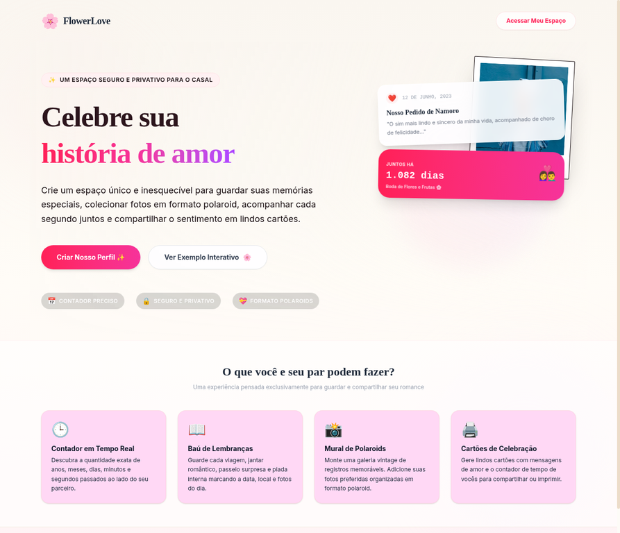
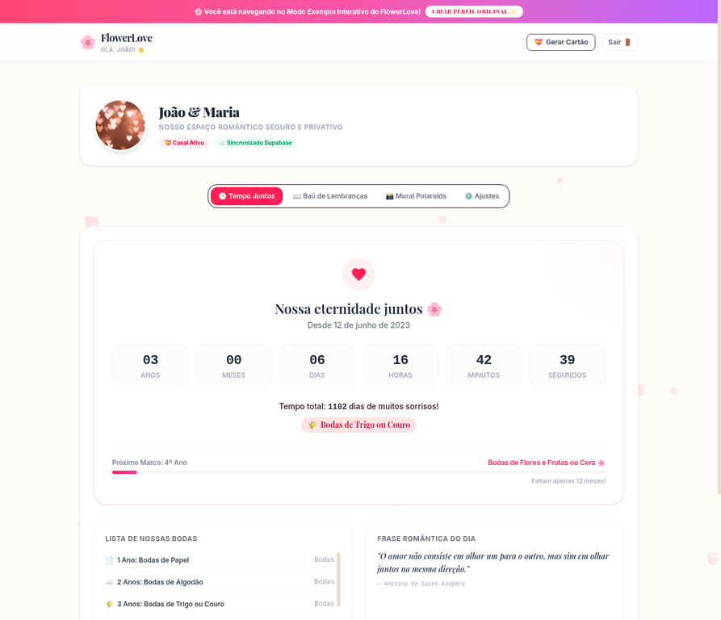
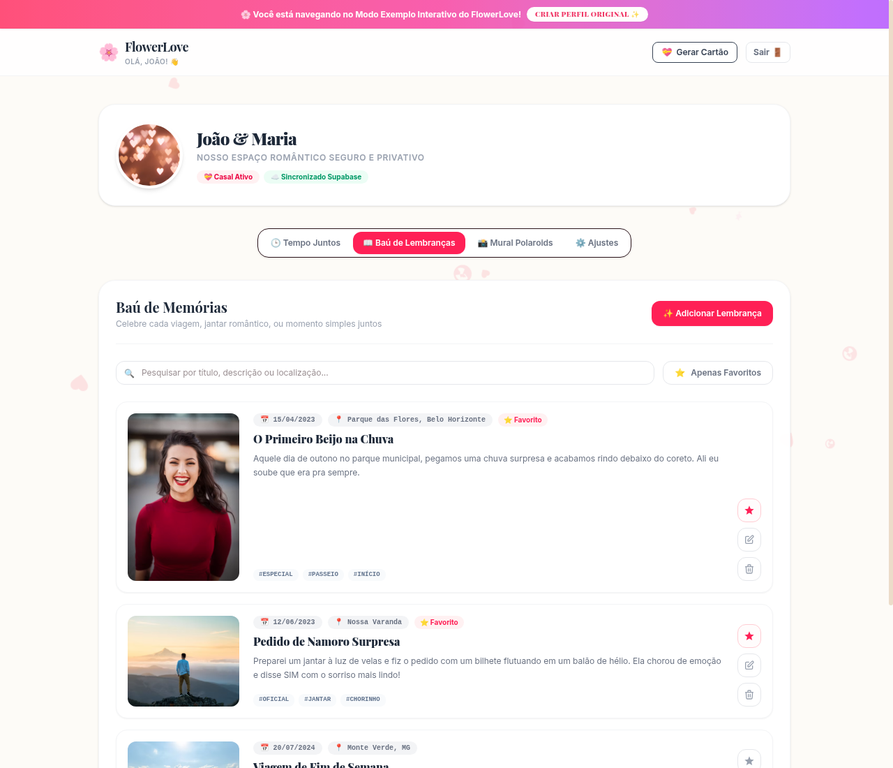
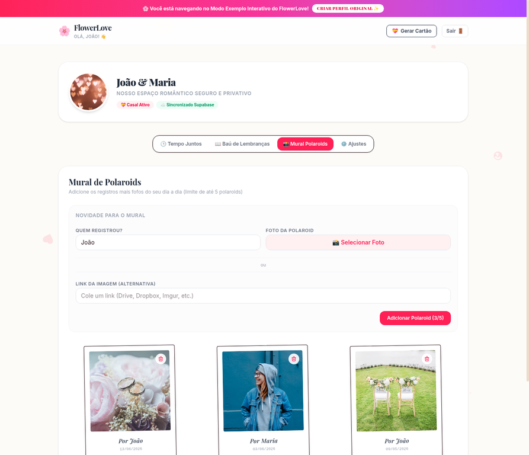
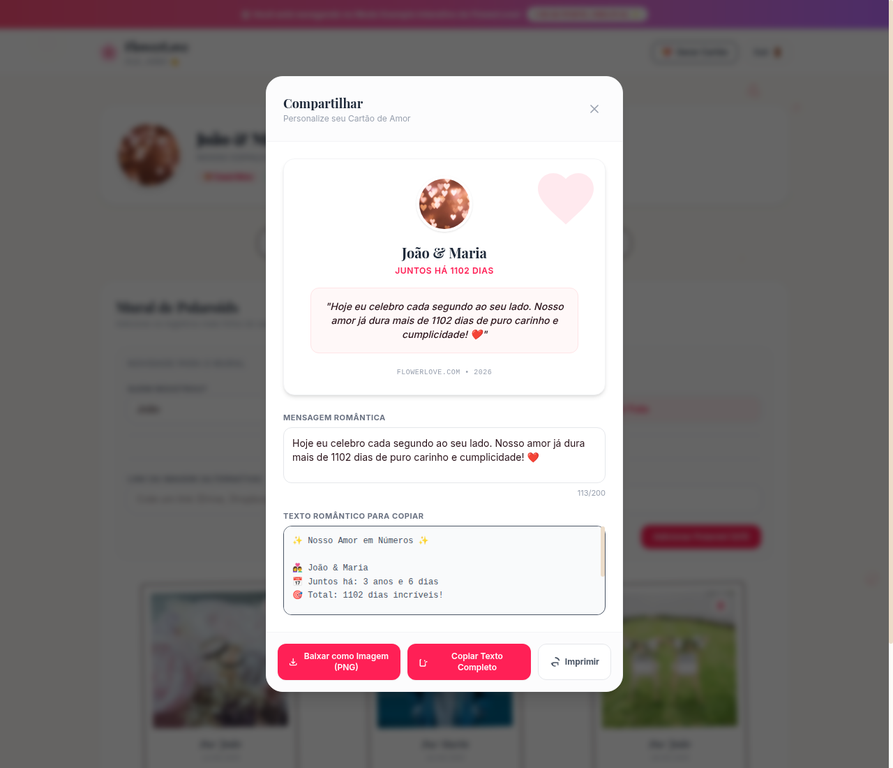

# FlowerLove 🌸

## Um Espaço Romântico e Privativo para Casais

FlowerLove é uma plataforma dedicada a casais que desejam celebrar e eternizar sua história de amor. Crie um espaço único e inesquecível para guardar memórias especiais, colecionar fotos em formato polaroid, acompanhar o tempo juntos e compartilhar sentimentos em lindos cartões.

### Visão Geral

FlowerLove oferece uma experiência personalizada para que cada casal possa registrar e reviver seus momentos mais preciosos. Com uma interface intuitiva e recursos pensados para o romance, é o lugar perfeito para nutrir o amor.

### Funcionalidades Principais

#### 🕒 Contador Preciso

Acompanhe a quantidade exata de anos, meses, dias, minutos e segundos passados ao lado do seu parceiro. Celebre cada marco com precisão e carinho.

#### 📖 Baú de Lembranças

Guarde cada viagem, jantar romântico, passeio surpresa e piada interna. Registre a data, local e adicione fotos para reviver esses momentos sempre que quiser.

#### 📸 Mural de Polaroids

Monte uma galeria vintage com seus registros mais memoráveis. Adicione suas fotos preferidas organizadas em formato polaroid, criando um mural visualmente encantador.

#### 💝 Cartões de Celebração

Gere lindos cartões personalizados com mensagens de amor e o contador de tempo de vocês. Compartilhe digitalmente ou imprima para um toque especial.

### Contribuição

Sinta-se à vontade para contribuir com o projeto! Para sugestões, melhorias ou reportar bugs, por favor, abra uma issue ou envie um pull request.

### Licença

Este projeto está licenciado sob a [MIT License](LICENSE).

---

Feito com ❤️ por Ganso Dev para casais apaixonados.
